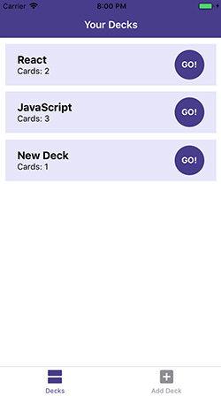
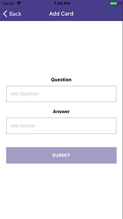
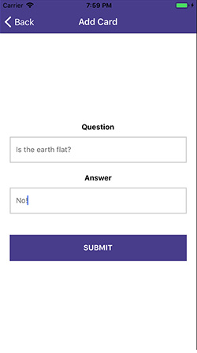
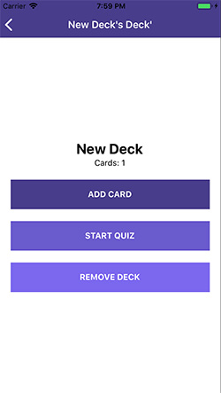
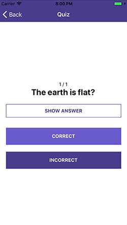

# Mobile Flashcard
##### React Native & Redux App

### How to install
`$ git clone https://github.com/nicolastelfer/mobile-flashcards.git`

`$ cd mobile-flashcards`

`$ yarn install`

`$ yarn start`

## Run the App

This App uses `Expo`(https://expo.io/) to help build this React Native App.

For svg icons, this app uses **expo vector icons**

`$ yarn add @expo/vector-icons --dev`

**This project was only tested on the iOS simulator.**

## Styling

This project uses **styled-components** to provide modular classes across the App. 

Find out more: https://www.styled-components.com/

## How the App looks
#### Deck List View

#### Add Deck View

#### Add Card View
With button disabled until fields have a value 

#### Individual View

#### Quiz View

#### Quiz Results View

### License
THE SOFTWARE IS PROVIDED "AS IS", WITHOUT WARRANTY OF ANY KIND, EXPRESS OR IMPLIED, INCLUDING BUT NOT LIMITED TO THE WARRANTIES OF MERCHANTABILITY, FITNESS FOR A PARTICULAR PURPOSE AND NONINFRINGEMENT. IN NO EVENT SHALL THE AUTHORS BE LIABLE FOR ANY CLAIM, DAMAGES OR OTHER LIABILITY, WHETHER IN AN ACTION OF CONTRACT, TORT OR OTHERWISE, ARISING FROM, OUT OF OR IN CONNECTION WITH THE SOFTWARE OR THE USE OR OTHER DEALINGS IN THE SOFTWARE.

For more information, please refer to https://unlicense.org